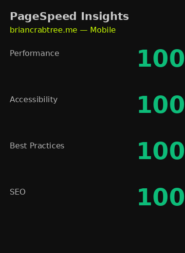
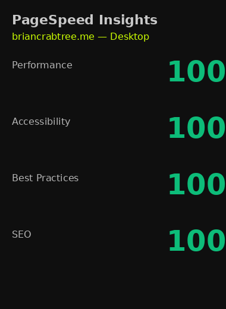
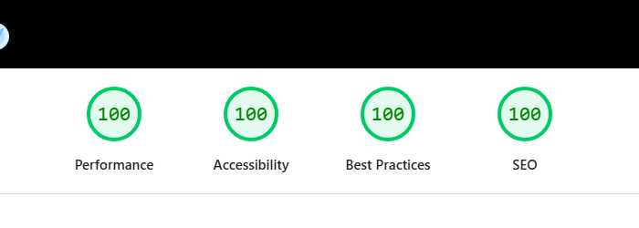

# pure-react-19-vanilla-starter

**Vite + React 19 + vanilla CSS** — prerender shell, inlined CSS before the module script, one vendor chunk. PSI-minded demo.

[](https://briancrabtree-me.github.io/pure-react-19-vanilla-starter/)
[](LICENSE)
[](https://github.com/briancrabtree-me/vanilla-css-tokens)
[](https://github.com/briancrabtree-me/snippet-library)
[](https://github.com/briancrabtree-me/react-pubsub-store)

**[Live demo](https://briancrabtree-me.github.io/pure-react-19-vanilla-starter/)** · **[Architecture](docs/ARCHITECTURE.md)** · **[PSI](docs/PSI.md)** · **[Deploy](docs/DEPLOY.md)** · **[vanilla-css-tokens](https://github.com/briancrabtree-me/vanilla-css-tokens)** · **[snippet-library](https://github.com/briancrabtree-me/snippet-library)** · **[react-pubsub-store](https://github.com/briancrabtree-me/react-pubsub-store)**

---

## What you get

- React 19 — functional components, lazy routes, no UI framework
- Vanilla CSS — custom properties; see [vanilla-css-tokens](https://github.com/briancrabtree-me/vanilla-css-tokens), [snippet-library](https://github.com/briancrabtree-me/snippet-library), [react-pubsub-store](https://github.com/briancrabtree-me/react-pubsub-store)
- Prerender shell — first paint in HTML before JS
- Postbuild — app CSS inlined before `type="module"`
- PageSpeed lab proof below

---

## PageSpeed

### Portfolio — [briancrabtree.me](https://briancrabtree.me/)

| Mobile | Desktop |
|--------|---------|
|  |  |

### This demo (GitHub Pages)

| Mobile | Desktop |
|--------|---------|
|  |  |

**100 / 100 / 100 / 100** (mobile + desktop). Archived runs: [mobile · lo5ura31eh](https://pagespeed.web.dev/analysis/https-briancrabtree-me-github-io-pure-react-19-vanilla-starter/lo5ura31eh?form_factor=mobile) · [desktop](https://pagespeed.web.dev/analysis/https-briancrabtree-me-github-io-pure-react-19-vanilla-starter/lo5ura31eh?form_factor=desktop) · [run again](https://pagespeed.web.dev/analysis?url=https%3A%2F%2Fbriancrabtree-me.github.io%2Fpure-react-19-vanilla-starter%2F)

---

## Quick start

```bash
git clone https://github.com/briancrabtree-me/pure-react-19-vanilla-starter.git
cd pure-react-19-vanilla-starter
npm install
npm run dev
```

```bash
npm run typecheck
npm run build
npm run preview
```

`npm run build` gzip: ~73 KB `core-ui` + ~2 KB entry (hash varies).

---

## Layout

| Path | Role |
|------|------|
| `index.html` | Inline shell for first paint |
| `scripts/postbuild-html.mjs` | CSS before module JS; `/about` HTML shell |
| `vite.config.ts` | `core-ui` chunk (react + router) |
| `hooks/useIdleEffect.ts` | Below-fold work after idle |
| `utils/prerenderShell.ts` | Drop shell when hero image loads |
| `styles/index.css` | Tokens and home styles |

---

## Deploy

`main` → GitHub Pages via [`.github/workflows/deploy-pages.yml`](.github/workflows/deploy-pages.yml). First time: **Settings → Pages → GitHub Actions**.

```bash
VITE_BASE_PATH=/pure-react-19-vanilla-starter/ \
PUBLIC_SITE_URL=https://briancrabtree-me.github.io/pure-react-19-vanilla-starter \
npm run build
```

Root-domain deploy: omit `VITE_BASE_PATH`. Details: [docs/DEPLOY.md](docs/DEPLOY.md).

---

<p align="center">
<sub>© 2026 Brian Crabtree · ALL RIGHTS RESERVED · MIT <a href="LICENSE">LICENSE</a></sub>
</p>
